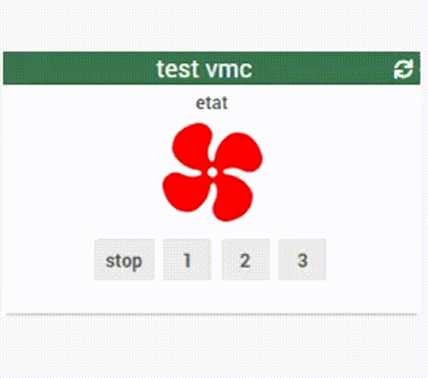
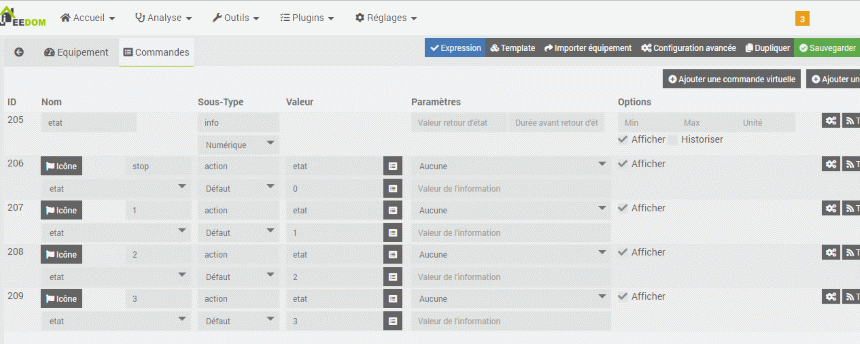
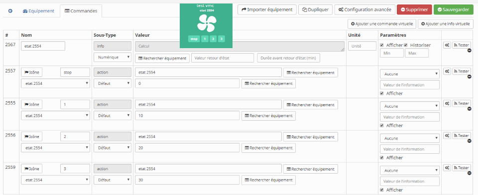

# WIDGET SPECIFIQUE info numeric VMC

par default
couleur = white,yellow,orange,red
vitesse = 0,1,2,3

### Création de commande

mode avancé (valeur à configurer en paramètres optionnels

### Paramètres Optionnels

