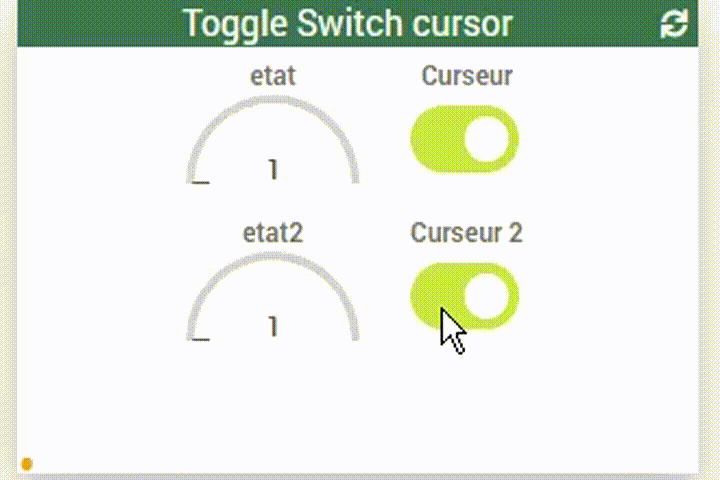

# WIDGET SPECIFIQUE action slider input numérique

Sur la une base de checkbox
Permet de switcher une valeur 0 ou 1
avec un effet annimation

Mise à jour :
- Le 2020/5/3 : conforme jeedom v4.0.52

screen de configuration

### Exemples mise en place

https://youtu.be/l02K5fm2Uqw
