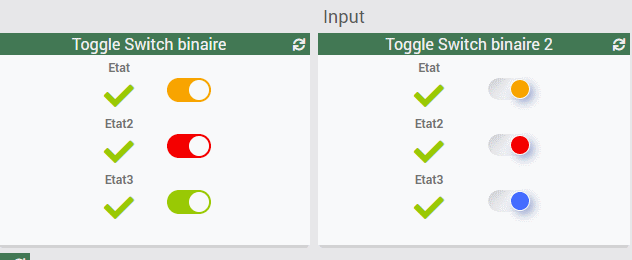
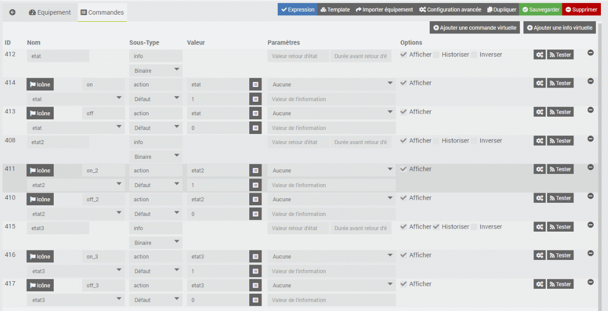
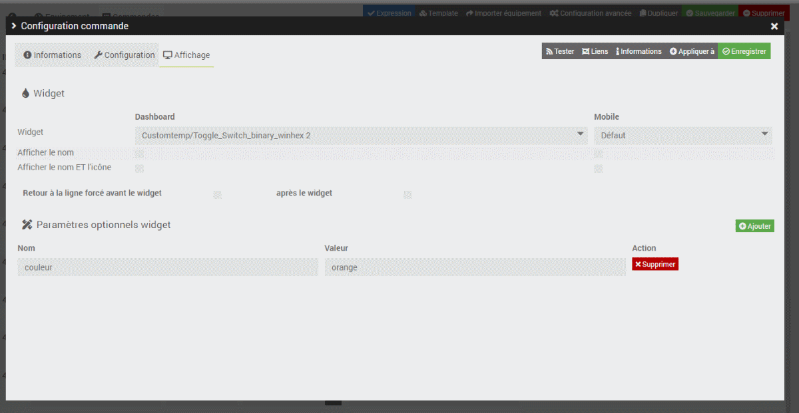

# WIDGET SPECIFIQUE action binaire input numérique

Sur la une base de checkbox
Permet de switcher une valeur 0 ou 1
avec un effet annimation.

Mise à jour :
- Le 2020/5/30 : conforme jeedom v4.0.56

2 modéles (sans changement "voir plus bas" couleur etat3)

screen de création commande

screen de configuration avancé (changement de couleur)
pour les 2 actions "On et Off"

couleurs acceptés : hexa, rgb, nom.
+ le 2éme prends les gradients
exemple en valeur :
<code>linear-gradient(to left, #bdc3c7, #2c3e50)</code>
