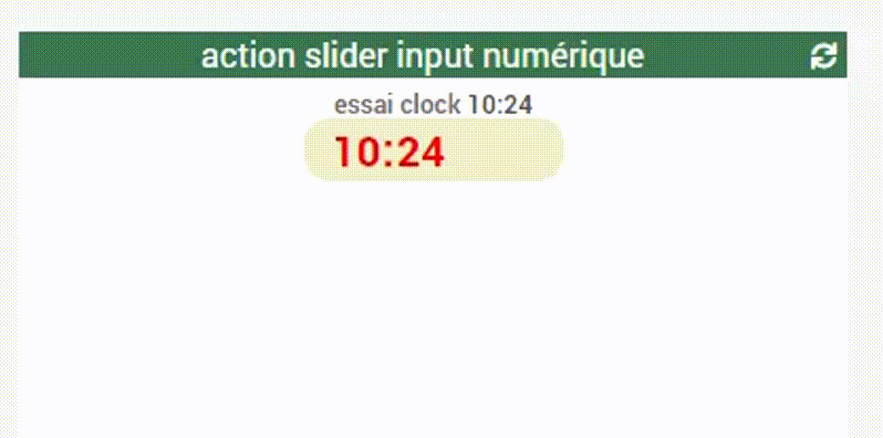

# WIDGET SPECIFIQUE action slider input numérique

Permet de renseigner 2 valeurs numérique heure et minute
touche "Entrée" pour une validation PC

Mise à jour :

- Le 2020/3/15 : conforme jeedom v4.0.43




Screen de configuration


Utilisation
testeur d'expression :
```php
'#[input][action slider input numérique][essai clock]#' == '06:45'
Je vais évaluer : '06:45' == '06:45'
Résultat : true
```
```php
'#[input][action slider input numérique][essai clock]#' == '#heure#:#minute#'
Je vais évaluer : '06:45' == '23:56'
Résultat : false
```
```php
'time_op(str_replace(:,, #[input][action slider input numérique][essai clock]#), -120)'
Je vais évaluer : '445'
Résultat : 445
```


Scenario fonction A
```php
str_replace(:,, #[input][action slider input numérique][essai clock]#)
```
ou
```php
'str_replace(:,, #[input][action slider input numérique][essai clock]#)'
```
```log
[2020-03-16 00:07:23][SCENARIO] Start : Scenario execute automatiquement sur evenement venant de : [input][action slider input numerique][essai clock].
[2020-03-16 00:07:23][SCENARIO] Exécution du sous-élément de type [condition] : at
[2020-03-16 00:07:23][SCENARIO] Evaluation de la condition : ['1124'] = 1124
[2020-03-16 00:07:23][SCENARIO] Tâche : 6 programmée à : 2020-03-16 11:24:00
[2020-03-16 00:07:23][SCENARIO] Fin correcte du scénario
```
