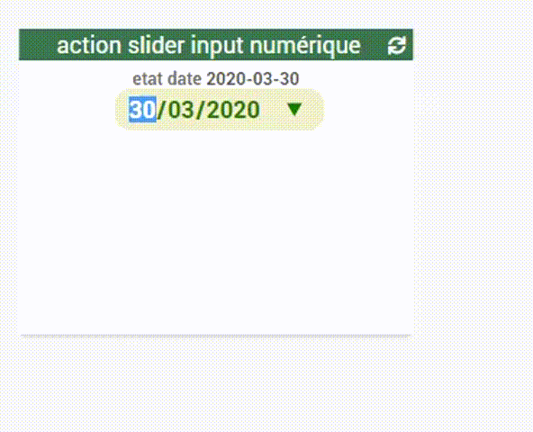

# WIDGET SPECIFIQUE action slider input date

Permet de renseigner une valeur date.
touche "Entrée" pour une validation PC

Mise à jour :
- Le 2020/3/30 :  conforme jeedom v4.0.45

### Exemples mise en place

https://youtu.be/l02K5fm2Uqw

