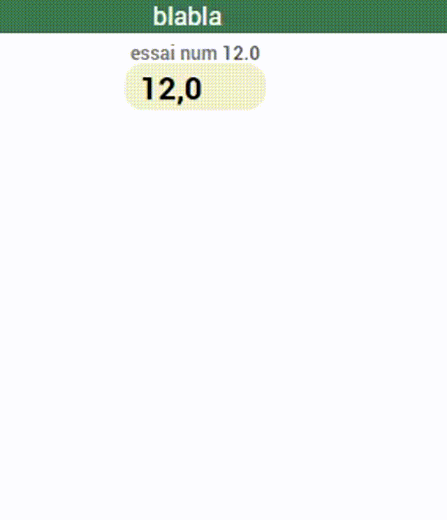

# WIDGET SPECIFIQUE action slider input numérique

Permet de renseigner une valeur numérique.
touche "Entrée" pour une validation PC

Mise à jour :
- Le 2020/3/08 : ajjout button effacement "branche beta"
- Le 2020/2/20 : conforme jeedom v4.0.43

vidéo youtube
https://youtu.be/6Y_U8OSmTd4

screen de configuration

